# 대구대학교 졸업

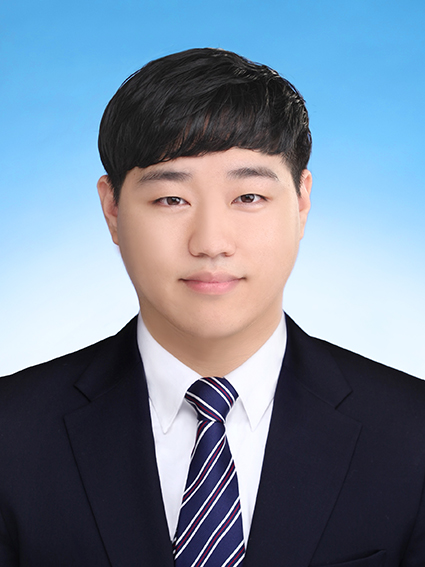

## 이름 : 안재영
## 연락처
 - Phone : 010 - 6680 - 9683
 - E-Mail : ababqw123@naver.com
 - GitHub : <https://github.com/ababqw123>

## 학력
### 전공 : 전자전기 공학과
### 학점 : 3.39/4.5
 

## 개발 언어 및 스킬
 ○ C#, ASP.Net, HTML, CSS, JavaScript, Node.js, Python, Django, MS-SQL, TypeScript
 

## 자격증
 ○ 정보처리기사
  
 ○ SQLD
 
 ---
 ### 프로젝트 및 개발 경험
  - HTML, CSS, JavaScript를 이용한 웹 클론코딩
  - C# 스터디 카페 관리 프로그램
  - API와 부트스트랩을 이용한 팀 페이지 및 개인 페이지 제작

## 웹 클론코딩

### 카드형 페이지
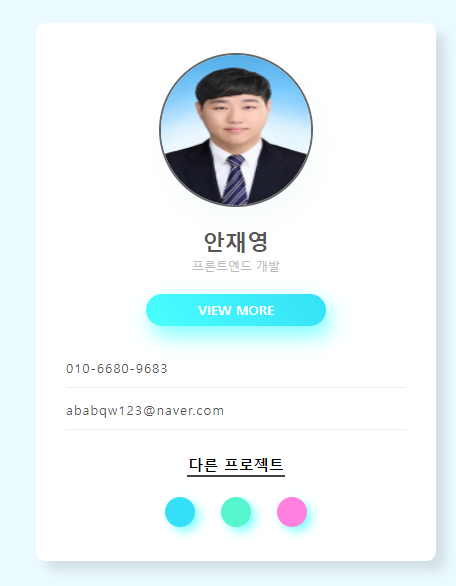
 

### 일반 페이지
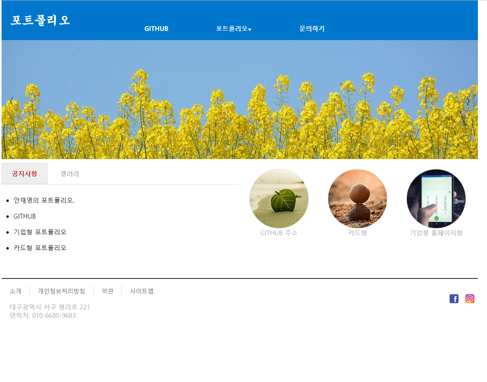
 

### 기업형 페이지
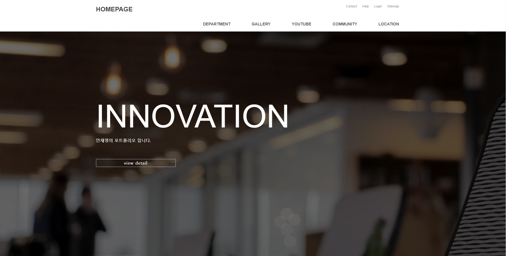
 

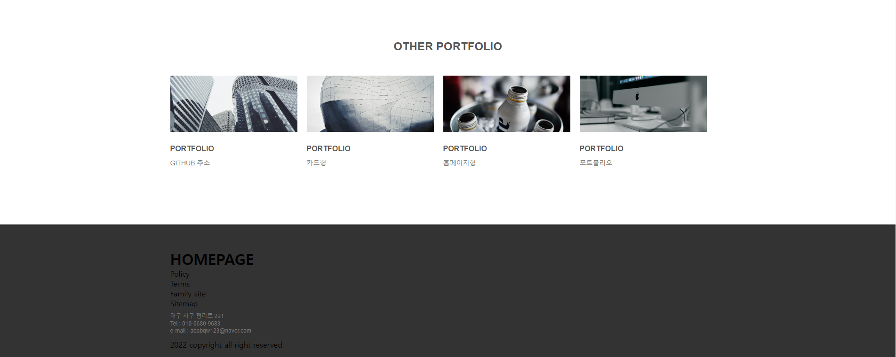
 

### 기능 및 구현
 - HTML, CSS, JavaScript 연습을 위하여, 카드형 페이지, 기업형 페이지, 일반 페이지 등으로 나누어 페이지 형태 클론 코딩
 GitHub : https://github.com/ababqw123/page
 주소 : https://jaeyeong-page.netlify.app

## C# 스터디 카페 관리 프로그램

### 메인화면
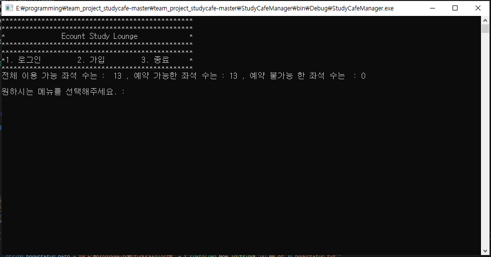
 

### 회원가입
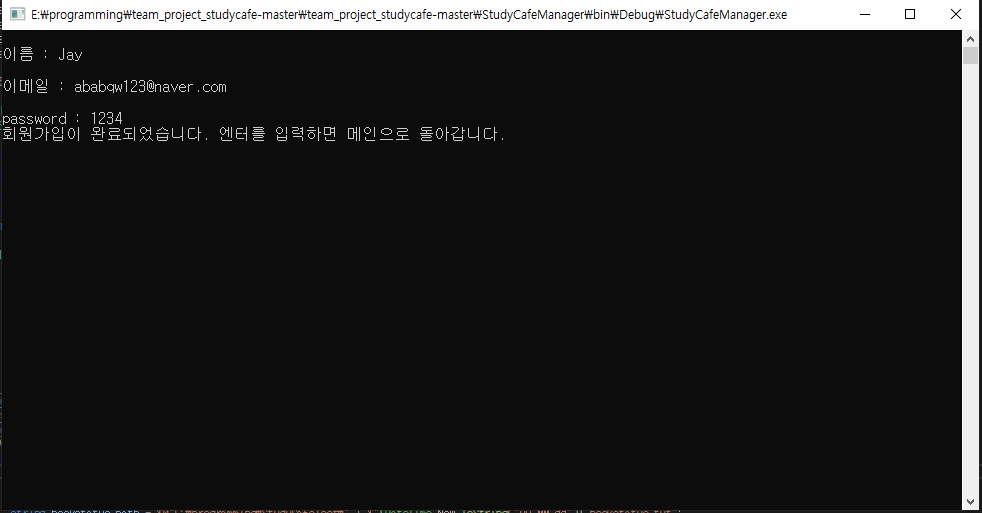
 

### 로그인 후 화면
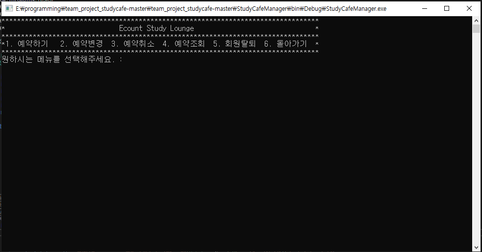
 

### 예약
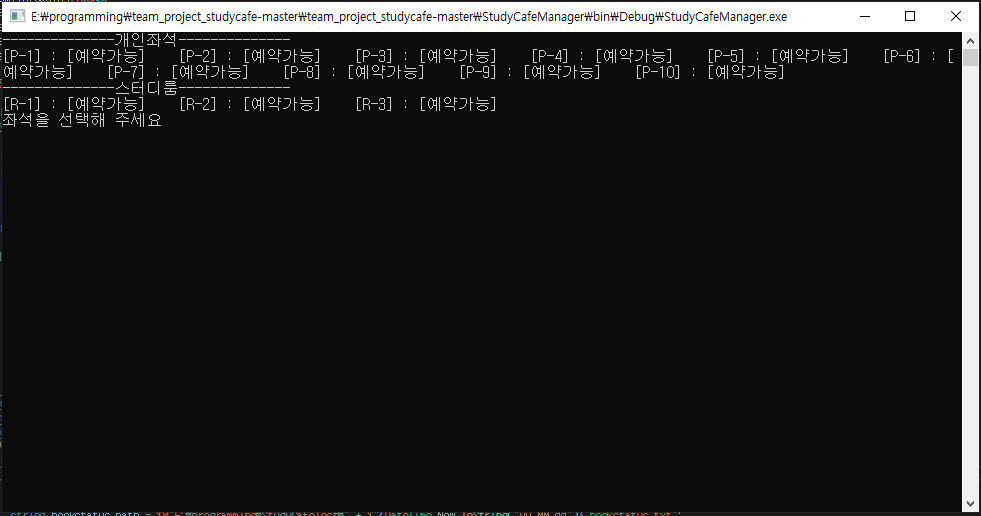
 

### 예약확인
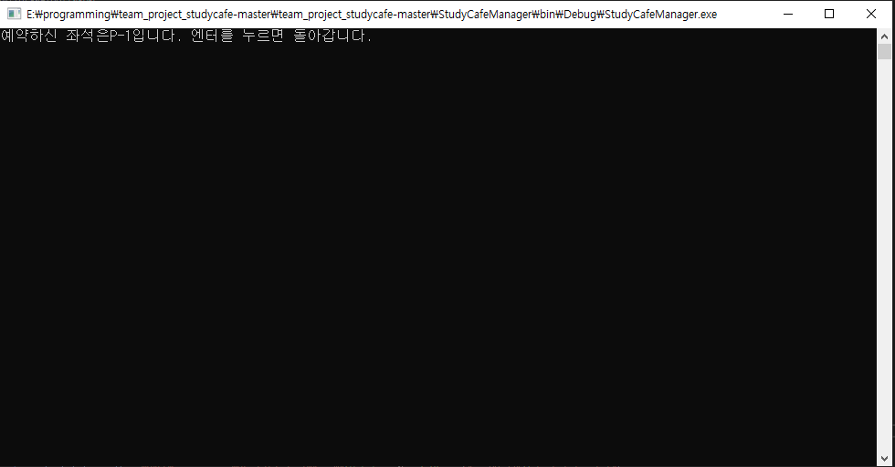
 

### 기능 및 구현
 - C# 콘솔창을 이용하여 Text 파일 사용, 스터디 카페의 회원가입, 예약, 예약취소, 확인 등의 기능을 구현
 GitHub : https://github.com/ababqw123/page
 
 
## API와 부트스트랩을 이용한 팀 페이지 및 개인 페이지 제작

### 개인 소개 페이지(메인)
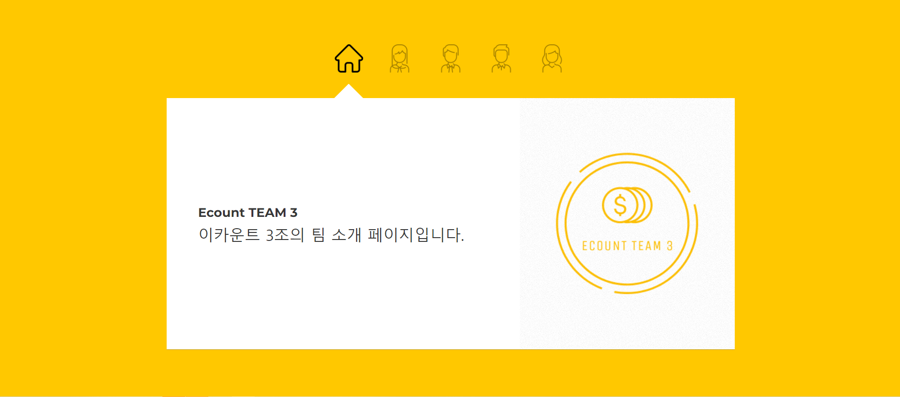
 

### 개인 소개 페이지(개인)
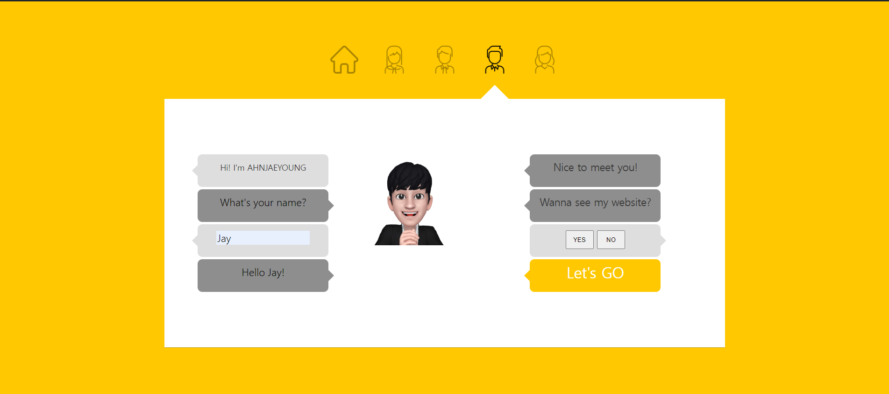
 

### API구현(kanban board)

 

### API구현(지도-현재 위치 찾기)
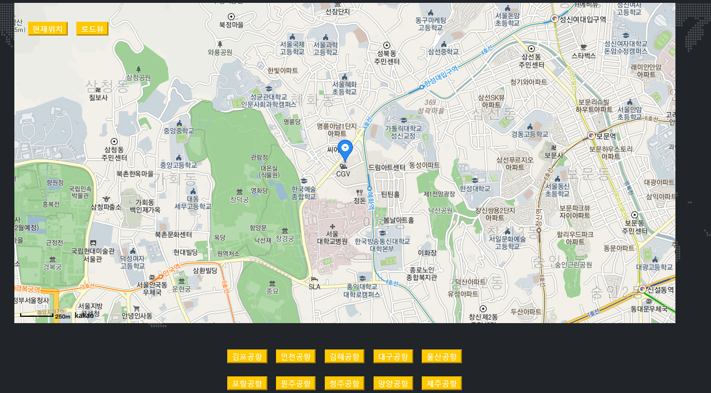
 

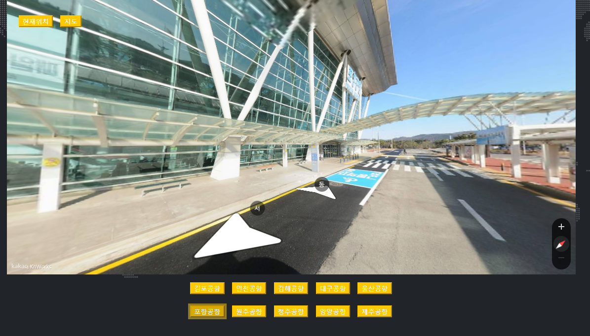
 
